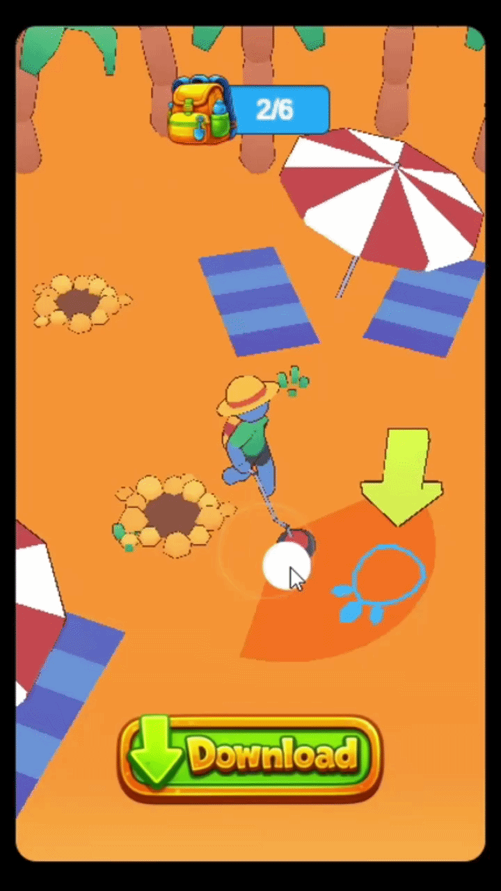

# Unity Playable Ad Demo

A mobile-first playable ad prototype built with Unity WebGL, focused on interactive gameplay onboarding and ad-style UX flow.

---

## 🎮 Live Demo

👉 https://christopherlaino.github.io/unity-playable-ad-demo/

---

## 🎥 Gameplay Preview

  

---

## 📱 Project Overview

This project is a portfolio-safe adaptation of a real playable ad production workflow originally developed for a client.

The original production version included SDK integration pipelines targeting multiple advertising providers, including:

- AppLovin
- Google
- Mintegral

The purpose of the playable was to introduce and simplify the game's core gameplay loop through a short interactive ad experience optimized for mobile acquisition campaigns.

For public portfolio release:

- All original proprietary assets were removed
- Original branding and visual content were replaced
- CC0/public-domain assets were used where possible
- Additional placeholder visuals were generated using AI tools

The gameplay structure, interaction flow, and playable ad logic were preserved to demonstrate production-oriented implementation and UX design.

---

## ⚙️ Tech Stack

- Unity Engine
- C#
- Unity WebGL
- HTML5 wrapper

---

## 🎯 Focus Areas

This project demonstrates experience with:

- Playable ads development
- Unity WebGL workflows
- Mobile-first UX
- Interactive onboarding flows
- Lightweight browser-based game experiences
- Advertising-oriented gameplay design

---

## 📦 Features

- Lightweight WebGL build
- Touch-friendly controls
- Mobile-oriented layout
- Interactive tutorial flow
- Gameplay-focused ad structure
- Browser-playable deployment

---

## 🧠 Notes

This repository contains a standalone portfolio version only.

No proprietary SDKs, client assets, internal tools, or commercial advertising integrations are included in this public release.

---

## 👤 Author

Christopher Laino  
Unity Developer specializing in playable ads, WebGL experiences, and interactive mobile marketing creatives.
